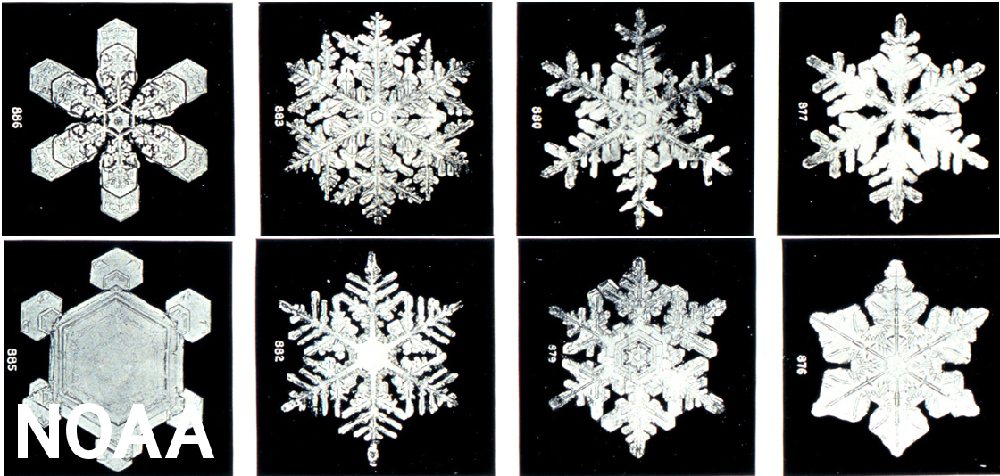
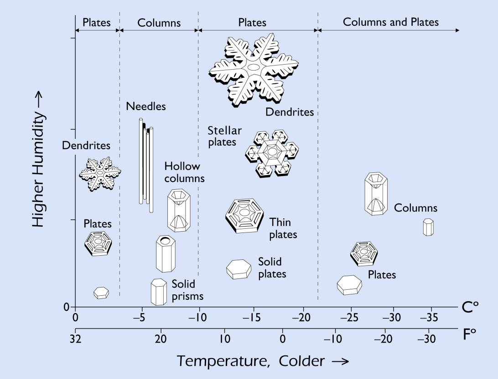

# Sneeuwvlok maker

Kijk eens naar de plaatjes van een sneeuwvlok (of eigenlijk een sneeuwkristal). Herken je ze als een sneeuwvlok?

Het zijn foto's van sneeuwvlokken die in de natuur tegen zijn gekomen. Ze zijn opgevangen en daarna onder een microscoop gefotografeerd om ze in detail beter te kunnen zien (met het blote oog zul je ze waarschijnlijk...  niet zo zien :wink:). 



<details>
<summary>Maar, ... wat als je andere sneeuwvlokken hebt gezien?</summary>

> De foto's laten voorbeelden van sneeuwvlokken zien, maar het is bekend dat sneeuwkristallen in nog meer verschillende vormen kunnen voorkomen, zoals je kan zien in het diagram,

>
> Mocht jezelf heel andere sneeuwvlokken hebben gezien, kan je die eens proberen te tekenen?

</details>

Hieronder vind je een uitleg hoe je sneeuwkristallen kan tekenen op de computer met `p5.js` (wil je liever een filmpje zien? Op basis van [deze Engelse uitleg](https://youtu.be/R3C2giDfmO8) is deze Nederlandse uitleg geschreven). 

Sneeuwvlokken kan je op verschillende manieren 'maken',
- door te [vouwen en te knippen](https://nzmaths.co.nz/sites/default/files/SnazzySnowflakes.pdf),
- met een potlood te [tekenen](https://youtu.be/M39LnEEfl1s),
- en als je een speciaal laboratorium hebt... kan je ze ook ['echt'](https://youtu.be/ao2Jfm35XeE) maken.

Kan jij nog andere manieren bedenken?

## Symmetrie
Kijk eens naar de volgende tekening,


<p align = "center">
Sneeuwkristal - Gemaakt in een laboratorium voor de Disney film Frozen
</p>

Wat zie je? 

Zie je, bijvoorbeeld, de herhaling in de ronde, of "draai symmetrie"?


Zie je misschien ook de "spiegel symmetrie"?


Zie je nog misschien nog meer?

## Tekenen

Hieronder wordt uitgelegd hoe je digitaal kan tekenen met `p5js`. Stap voor stap 
laat het je zien hoe je:
- digitaal papier klaar legt,
- een je muis als digitaal potlood kan gebruiken,
- een tekening kan bewaren op je computer,
- een je een hele kleurdoos tot je beschikking kan krijgen

Maar, ... mocht je nu even niet zoveel zin of tijd hebben om dit stap voor stap te doorlopen,
dan kan je [hier](###eind-code) ook al de **Eind code** vinden,

### Digitaal papier

Kopieer en plak eens onderstaande code in de [editor](https://editor.p5js.org/), 
en klik daarna op de "play" knop.
```javascript
let papier = {
    lengte: 400,
    hoogte: 400,
    kleur: {
        r: 220,
        g: 220,
        b: 220
    }
}

function setup() {
    createCanvas(papier.lengte, papier.hoogte);
    background(papier.kleur.r, 
               papier.kleur.g, 
               papier.kleur.b);
}

function draw() {
    
}
```
Als het goed is, zie je dat je nu een vierkant hebt gekregen, met een grijze kleur.
Dit vierkant is het papier waarop je kan tekenen.
<details>
<summary>Vind je de grijze kleur wat saai?</summary>

> Vind je de grijze kleur wat saai? Of wil je gewoon een andere kleur, dan kan je, 
> je eigen kleur "mengen", bijvoorbeeld met behulp van een [kleuren wiel](https://color.adobe.com/nl/create/color-wheel).
> 
> Digitale kleuren kunnen gemaakt worden door de "basis" kleuren
> **r**ood, **g**roen en **b**lauw met elkaar te mengen. De getallen geven aan hoeveel 
> er van elk van deze kleuren gemengd met elkaar zijn om de mengkleur te krijgen,
> ```javascript
> kleur: {
>     r: 220,
>     g: 220,
>     b: 220
> }
> ```
> Als je de kleur wilt veranderen, dan kan je deze getallen veranderen. 

</details>

### Digitaal potlood

#### Alsof het potlood vast zit aan het papier

<details>
<summary>Start code!</summary>

[](./snippets/paper.js ':include :type=code javascript')

</details>

Met de **Start code** kunnen we "digitaal" papier maken en het de kleur geven die we willen.

Kopieer en plak een onderstaande code binnenin de functie `draw` (tussen de `{ }`),
en klik op de "play" knop,

[](./snippets/pencil_down_draw.js ':include :type=code javascript :fragment=potlood')

Wat gebeurt er, als je nu met je muis over het grijze over je digitale papier heen beweegt?
Als het goed is, zie je een lijn verschijnen, en kan je tekenen!

#### Het potlood optillen en neerzetten

<details>
<summary>Start code!</summary>

[](./snippets/pencil_down_draw.js ':include :type=code javascript')

</details>

Met de **Start code** kunnen we een lange lijn tekenen. Maar, stel je eens voor dat je een 
echt papier en potlood hebt, hoe teken je dan meerdere lijnen? Klopt het dat je dit doet door 
het potlood even op te tillen, van het papier af te halen, en daarna ergens anders op het 
papier weer neer te zetten?

Digitaal zouden we het neerzetten van het potlood kunnen doen door een knop van de muis in te drukken, 
en het optillen kunnen doen door de knop van de muis los te laten. Vervang in de **Start code**, de code tussen `/// [potlood]` eens voor,

[](./snippets/pencil_up_and_down_draw.js ':include :type=code javascript :fragment=potlood')

en druk vervolgens op de "play" knop. Lukt het nu om meerdere lijnen te tekenen?


### Tekening bewaren

<details>
<summary>Start code!</summary>

[](./snippets/pencil_up_and_down_draw.js ':include :type=code javascript')
</details>


Met de **Start code** kunnen we meerdere zwarte lijnen tekenen door, 
- de muis als digitaal potlood over het digitale tekenpapier te bewegen, en
- het digitale potlood met de muisknop 'op en neer' te bewegen. 

Maar, wat als je, je tekening nu wilt bewaren (bijvoorbeeld om uit te printen)?

Om onze tekening op te kunnen slaan op de computer, kunnen we een instructie `save` 
toevoegen die we kunnen bedienen met een 'save' knop. Om de 'save' knop toe te voegen onder ons 
digitale papier, kopieer en plak de volgende code binnenin de functie `setup`,

[](./snippets/save_drawing.js ':include :type=code javascript :fragment=save-knop')

Wanneer je nu op "play" klikt, zie je dan de knop onderaan het papier? 

Als je nu op de 'save' knop zou klikken, zou er nog niet zoveel moeten gebeuren 
(probeer maar eens :wink:). Om de tekening op te kunnen slaan moeten we de knop nog verbinden 
met een `save` instructie. Kopieer en plak onderstaande code eens boven
de functie `setup`,

[](./snippets/save_drawing.js ':include :type=code javascript :fragment=save-instructie') 

Als je nu een tekening maken en daarna op de 'save' knop drukt, wat gebeurt er dan? Kan je de tekening opslaan op je computer?  

### Kleur potloden

<details>
<summary>Start code!</summary>

[](./snippets/save_drawing.js ':include :type=code javascript')

</details>

Met de **Start code** kunnen we meerdere zwarte lijnen tekenen door, 
- de muis als digitaal potlood over het digitale tekenpapier te bewegen, en
- het digitale potlood met de muisknop 'op en neer' te bewegen. 

Maar, stel je eens voor dat je lijnen in verschillende kleuren zou willen maken?

Als eerste hebben we daar digitale kleurpotloden voor nodig, of een digitale kleurdoos.
Kopieer en plak onderstaande code eens boven de functie `setup`, 

[](./snippets/pencil_coloured.js ':include :type=code javascript :fragment=kleurdoos')

Dit stukje code legt aan de computer uit hoe die een "digitale kleurdoos" moet maken. 

Voordat we een kleurdoos kunnen gebruiken, moeten we die eerst maken en klaarzetten. 
Daarvoor, kopieer en plak de volgende code binnenin de functie `setup`,

[](./snippets/pencil_coloured.js ':include :type=code javascript :fragment=kleurdoos-klaarzetten')

Als je nu de code "draait" door op de "play" knop te klikken, zou je 3 "sliders" te zien moeten krijgen.
Met deze sliders kan je een kleur mengen: Door de schuiven voeg je meer of minder van de basis kleuren rood, groen of blauw toe, en kan je elke kleur mengen die je zou willen!

Maar... om te zien wat de kleur is die je gemengd hebt, en om daar ook mee te kunnen tekenen, moeten we nog 
een stukje code toevoegen. Kopieer en plak de volgende code binnenin de fucntie `draw`, en dan bovenaan, 

[](./snippets/pencil_coloured.js ':include :type=code javascript :fragment=kleurdoos-kleur-kiezen')

Als je nu op "play" klikt, en de schuiven wat heen en weer geschoven hebt, wat zie je gebeuren?
En, als je nu met een muisknop ingedrukt je muis over het digitale papier beweegt, kan je dan lijnen maken met de kleur die je "gemengd" hebt? 

### Eind code

<details>
<summary>Eind code!</summary>

[](./snippets/drawing.js ':include :type=code javascript')

</details>

## Tekenen also je 6 handen hebt

Heb je wel eens geprobeerd met twee handen tegelijk te tekenen, in beide een potlood en dan proberen de potloden zo te sturen dat je twee keer hetzelfde tekend?


