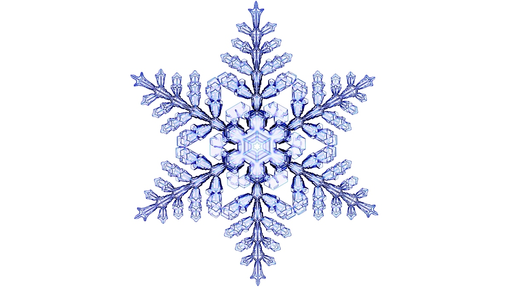
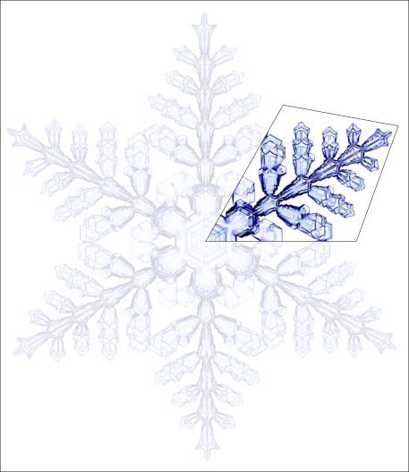
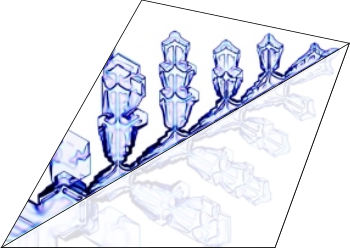

# Sneeuwvlokmaker

Kijk eens naar de plaatjes van een sneeuwvlok (of eigenlijk een sneeuwkristal). Herken je ze als een sneeuwvlok?

Het zijn foto's van sneeuwvlokken die in de natuur tegen zijn gekomen. Ze zijn opgevangen en daarna onder een microscoop gefotografeerd om ze in detail beter te kunnen zien, 


Met het blote oog zul je ze waarschijnlijk...  niet zo zien, toch? Hieronder zie je sneeuwkristallen van papier. Ze zijn gemaakt in 1864 door iemand die de sneeuwvlokken zag vallen op haar vensterbank,


<details>
<summary>Maar, ... wat als je andere sneeuwvlokken hebt gezien?</summary>

> De foto's laten voorbeelden van sneeuwvlokken zien, maar het is bekend dat sneeuwkristallen in nog meer verschillende vormen kunnen voorkomen, zoals je kan zien in het diagram,

>
> Mocht jezelf heel andere sneeuwvlokken hebben gezien, kan je die eens proberen te tekenen?

</details>

Hieronder vind je een uitleg hoe je een programma kan schrijven met `p5js` waarmee je vervolgens sneeuwkristallen kan tekenen op de computer (wil je liever een filmpje zien? Op basis van [deze Engelse uitleg](https://youtu.be/R3C2giDfmO8) is deze Nederlandse uitleg geschreven). 

Sneeuwvlokken kan je op verschillende manieren 'maken',
- door te [vouwen en te knippen](https://nzmaths.co.nz/sites/default/files/SnazzySnowflakes.pdf),
- met een potlood te [tekenen](https://youtu.be/M39LnEEfl1s),
- en als je een speciaal laboratorium hebt... kan je ze ook ['echt'](https://youtu.be/ao2Jfm35XeE) maken.

Kan jij nog andere manieren bedenken?

(Wil je meteen gaan tekenen of met de eind code aan de slag? Spring dan meteen naar [Sneeuwvlok maken](##sneeuwvlok-maken))
## Symmetrie
Kijk eens naar de volgende tekening,



<p align = "center">
Sneeuwkristal - Gemaakt in een laboratorium voor de Disney film Frozen
</p>

Wat zie je? 

Zie je, bijvoorbeeld, de herhaling in de ronde, of "draai symmetrie"?



Zie je misschien ook de "spiegel symmetrie"?



Zie je misschien nog meer?

## Tekenen

Hieronder wordt uitgelegd hoe je digitaal kan tekenen met `p5js`. Stap voor stap 
laat het je zien hoe je:
- [digitaal papier](###digitaal-papier) klaar legt,
- je muis als [digitaal potlood](###digitaal-potlood) kan gebruiken,
- een [tekening bewaren](###tekening-bewaren) kan op je computer,
- je een hele [kleurdoos](###kleurdoos) tot je beschikking kan krijgen.

Maar, ... mocht je er liever kris kras doorheen lopen, of maar bepaalde onderdelen willen doen, 
dan kan dit. Bijna elk tussenkopje begint met **begin code**, de code tot dan toe, die je de basis 
geeft om dat onderdeel te volgen. Je kan de **begin code** kopieren en plakken in de [`p5js` web editor](https://editor.p5js.org), om te kijken wat deze basis code doet. Vervolgens kan je de code aan passen,
- op basis van wat er in het tussenkopje beschreven staat, of 
- de beschrijving laten voor wat die is en de code aanpassen zoals je zelf denkt dat het zou moeten :wink: 

Nog anders, mocht je even niet zoveel zin of tijd hebben om de tussenkopjes te volgen, kris kras of opvolgorde, 
dan kan je [hier](###eind-code) ook al de **eind code** vinden.


### Digitaal papier

Kopieer en plak eens onderstaande code in de [editor](https://editor.p5js.org/), 
en klik daarna op de "play" knop.
```javascript
let papier = {
    lengte: 400,
    hoogte: 400,
    kleur: {
        r: 220,
        g: 220,
        b: 220
    }
}

function setup() {
    createCanvas(papier.lengte, papier.hoogte);
    background(papier.kleur.r, 
               papier.kleur.g, 
               papier.kleur.b);
}

function draw() {
    
}
```
Als het goed is, zie je dat je nu een vierkant hebt gekregen, met een grijze kleur.
Dit vierkant is het papier waarop je kan tekenen.
<details>
<summary>Vind je de grijze kleur wat saai?</summary>

> Vind je de grijze kleur wat saai? Of wil je gewoon een andere kleur, dan kan je, 
> je eigen kleur "mengen", bijvoorbeeld met behulp van een [kleuren wiel](https://color.adobe.com/nl/create/color-wheel).
> 
> Digitale kleuren kunnen gemaakt worden door de "basis" kleuren
> **r**ood, **g**roen en **b**lauw met elkaar te mengen. De getallen geven aan hoeveel 
> er van elk van deze kleuren gemengd met elkaar zijn om de mengkleur te krijgen,
> ```javascript
> kleur: {
>     r: 220,
>     g: 220,
>     b: 220
> }
> ```
> Als je de kleur wilt veranderen, dan kan je deze getallen veranderen. 

</details>

### Digitaal potlood

#### Alsof het potlood vast zit aan het papier

<details>
<summary>Begin code (code tot nu toe)</summary>

[](./snippets/paper.js ':include :type=code javascript')

</details>

Met de **begin code** kunnen we "digitaal" papier maken en het de kleur geven die we willen.

Kopieer en plak een onderstaande code binnenin de functie `draw` (tussen de `{ }`),
en klik op de "play" knop,

[](./snippets/pencil_down_draw.js ':include :type=code javascript :fragment=potlood')

Wat gebeurt er, als je nu met je muis over je grijze digitale papier heen beweegt?
Als het goed is, zie je een lijn verschijnen, en kan je tekenen!

#### Het potlood optillen en neerzetten

<details>
<summary>Begin code (code tot nu toe)</summary>

[](./snippets/pencil_down_draw.js ':include :type=code javascript')

</details>

Met de **begin code** kunnen we een lange lijn tekenen. Maar, stel je eens voor dat je een 
echt papier en potlood hebt, hoe teken je dan meerdere lijnen? Klopt het dat je dit doet door 
het potlood even op te tillen en daarna ergens anders op het papier weer neer te zetten?

Digitaal zouden we het neerzetten van het potlood kunnen doen door een knop van de muis in te drukken, 
en het optillen kunnen doen door de knop van de muis los te laten. Vervang in de **begin code**, de code tussen `/// [potlood]` eens voor,

[](./snippets/pencil_up_and_down_draw.js ':include :type=code javascript :fragment=potlood')

en druk vervolgens op de "play" knop. Lukt het nu om meerdere lijnen te tekenen?


### Tekening bewaren

<details>
<summary>Begin code (code tot nu toe)</summary>

[](./snippets/pencil_up_and_down_draw.js ':include :type=code javascript')
</details>


Met de **begin code** kunnen we meerdere zwarte lijnen tekenen door, 
- de muis als digitaal potlood over het digitale tekenpapier te bewegen, en
- het digitale potlood met de muisknop 'op en neer' te bewegen. 

Maar, wat als je, je tekening nu wilt bewaren (bijvoorbeeld om uit te printen)?

Om onze tekening op te kunnen slaan op de computer, kunnen we een instructie `save` 
toevoegen die we kunnen bedienen met een 'save' knop. Om de 'save' knop toe te voegen onder ons 
digitale papier, kopieer en plak de volgende code binnenin de functie `setup`,

[](./snippets/save_drawing.js ':include :type=code javascript :fragment=save-knop')

Wanneer je nu op "play" klikt, zie je dan de knop onderaan het papier? 

Als je nu op de 'save' knop zou klikken, zou er nog niet zoveel moeten gebeuren 
(probeer maar eens :wink:). Om de tekening op te kunnen slaan moeten we de knop nog verbinden 
met een `save` instructie. Kopieer en plak onderstaande code eens boven
de functie `setup`,

[](./snippets/save_drawing.js ':include :type=code javascript :fragment=save-instructie') 

Als je nu een tekening maakt en daarna op de 'save' knop drukt, wat gebeurt er dan? Kan je de tekening opslaan op je computer?  

### Kleurdoos

<details>
<summary>Begin code (code tot nu toe)</summary>

[](./snippets/save_drawing.js ':include :type=code javascript')

</details>

Met de **begin code** kunnen we meerdere zwarte lijnen tekenen door, 
- de muis als digitaal potlood over het digitale tekenpapier te bewegen,
- het digitale potlood met de muisknop 'op en neer' te bewegen, en
- de tekening bewaren.

Maar, stel je eens voor dat je lijnen in verschillende kleuren zou willen maken?

Als eerste hebben we daar digitale kleurpotloden voor nodig, of een digitale kleurdoos.
Kopieer en plak onderstaande code eens boven de functie `setup`, 

[](./snippets/pencil_coloured.js ':include :type=code javascript :fragment=kleurdoos')

Dit stukje code legt aan de computer uit hoe die een "digitale kleurdoos" moet maken. 

Voordat we een kleurdoos kunnen gebruiken, moeten we die eerst maken en klaarzetten. 
Daarvoor, kopieer en plak de volgende code binnenin de functie `setup`,

[](./snippets/pencil_coloured.js ':include :type=code javascript :fragment=kleurdoos-klaarzetten')

Als je nu de code "draait" door op de "play" knop te klikken, zou je 3 "sliders" te zien moeten krijgen.
Met deze sliders kan je een kleur mengen: Door de schuiven voeg je meer of minder van de basis kleuren rood, groen of blauw toe, en kan je elke kleur mengen die je zou willen!

Maar... om te zien wat de kleur is die je gemengd hebt, en om daar ook mee te kunnen tekenen, moeten we nog 
een stukje code toevoegen. Kopieer en plak de volgende code binnenin de functie `draw`, en dan bovenaan, 

[](./snippets/pencil_coloured.js ':include :type=code javascript :fragment=kleurdoos-kleur-kiezen')

Als je nu op "play" klikt, en de schuiven wat heen en weer geschoven hebt, wat zie je gebeuren?
En, als je nu met een muisknop ingedrukt je muis over het digitale papier beweegt, kan je dan lijnen maken met de kleur die je "gemengd" hebt? 

### Eind code

Hier is dan de eind code! Alle stukjes code die hierboven beschreven staan zul je hier in terug kunnen vinden. De code kan je gebruiken om tekeningen te maken maar bijvoorbeeld ook om als basis te gebruiken om verdere "teken code" te schrijven!

[](./snippets/drawing.js ':include :type=code javascript')

## Tekenen met 2 x 6 handen

Heb je wel eens geprobeerd met twee handen tegelijk te tekenen, in beide een potlood en dan proberen de potloden zo te sturen dat je twee keer hetzelfde tekent? 

Hier onder staat uitgelegd hoe je stap voor stap je "[digitale potlood](###digitaal-potlood)" kan aanpassen, zodat je,
- kan [tekenen alsof je 2 handen hebt](###tekenen-in-spiegelbeeld), met behulp van spiegel symmetrie,
- kan [tekenen alsof je 6 handen hebt](###tekenen-in-6-vlakken), door gebruik te maken van rotatie symmetrie,
- kan [tekenen alsof je 2 x 6 = 12 handen hebt](###tekenen-met-2-x-6-handen), door spiegel en rotatie symmetrie samen te voegen.

Maar, ... mocht je er liever kris kras doorheen lopen, of maar bepaalde onderdelen willen doen, 
dan kan dit. Bijna elk tussenkopje begint met **begin code**, code tot dan toe, die je de basis geeft om dat onderdeel 
te volgen. Bijvoorbeeld, je kan de **begin code** kopieren en plakken in de [`p5js` web editor](https://editor.p5js.org), om te kijken wat deze basis code doet. Vervolgens kan je de code aan passen,
- op basis van wat er in het tussenkopje beschreven staat, of 
- de beschrijving laten voor wat die is en de code aanpassen zoals je zelf denkt dat het zou moeten :wink: 

Nog anders, mocht je even niet zoveel zin of tijd hebben om de tussenkopjes te volgen, kris kras of opvolgorde, 
dan kan je [hier](###eind-code-2-x-6) ook al de **eind code** vinden.

### Tekenen in Spiegelbeeld
 
<details>
<summary>Begin code</summary>

[](./snippets/pencil_up_and_down_draw.js ':include :type=code javascript')
</details>

Kopieer en plak de **begin code** in de [editor](https://editor.p5js.org). Als je vervolgens op "play" 
klikt, dan, 
- zie je als het goed is een grijs "vel digitaal papier",
- kan je tekenen door je muisknop ingedrukt te houden en de muis over het digitale papier te bewegen.

Vervang eens in de code,

[](./snippets/pencil_up_and_down_draw.js ':include :type=code javascript :fragment=potlood')

voor,

[](./snippets/mirror_symmetry.js ':include :type=code javascript :fragment=potlood')

Wanneer je nu klikt op "play", en je gaat tekenen, wat zie je dan gebeuren?

Als het goed is zie je dat je met "twee handen" tekent, waarvan de ene het spiegelbeeld is van de andere: spiegel symmetrie!

### Het papier verdelen in vlakken

<details>
<summary>Begin code (code tot nu toe)</summary>

[](./snippets/pencil_up_and_down_draw.js ':include :type=code javascript')
</details>

Kopieer en plak eens de **begin code** in de [editor](https://editor.p5js.org). Als je vervolgens op "play" 
klikt, dan, 
- zie je als het goed is een grijs "vel digitaal papier",
- kan je tekenen door je muisknop ingedrukt te houden en de muis over het digitale papier te bewegen.

Voeg boven de functie `setup` eens de volgende code toe,

[](./snippets/divide_in_planes.js ':include :type=code javascript :fragment=hulp-vlakken')

en voeg binnenin `setup`, onderaan, de onderstande code toe,

[](./snippets/divide_in_planes.js ':include :type=code javascript :fragment=teken-vlakken')

Wanneer je nu klikt op "play", zie je dan wat gebeuren?

Als het goed is zie je nu,
- 6 lijnen die in het midden bijelkaar komen, en
- de lijnen verdelen het papier in 6 vlakken.

### Tekenen in 6 vlakken

<details>
<summary>Begin code (code tot nu toe)</summary>

[](./snippets/divide_in_planes.js ':include :type=code javascript')

</details>

Wanneer je de **begin code** kopieert en plakt in de [editor](https://editor.p5js.org) en vervolgens op "play" 
klikt, dan zie je als het goed is een papier verdeelt in 6 vlakken.

Vervang eens in de code,

[](./snippets/pencil_up_and_down_draw.js ':include :type=code javascript :fragment=potlood')

voor,

[](./snippets/rotation_symmetry.js ':include :type=code javascript :fragment=potlood')

Wanneer je nu klikt op "play" en je gaat daarna tekenen binnen een vlak, wat zie je dan gebeuren?

Als het goed is zie je dat je door in een vlak te tekenen, in alle vlakken tegelijk hetzelfde tekent: rotatie symmetrisch!

### Tekenen met 2 x 6 handen


<details>
<summary>Begin code (code tot nu toe)</summary>

[](./snippets/rotation_symmetry.js ':include :type=code javascript')

</details>

Wanneer je de **begin code** kopieert en plakt in de [editor](https://editor.p5js.org) en vervolgens op "play" 
klikt, dan kan je als het goed is in 6 vlakken tegelijk tekenen: met 6 handen!

Maar... het doel is om met 2 x 6 = 12 handen tegelijk te kunnen tekenen. Het "potlood" waarmee we met 6 
handen tekenen is,

[](./snippets/rotation_symmetry.js ':include :type=code javascript :fragment=potlood')

Om met 2 x 6 handen te tekeken, kunnen we bijvoorbeeld, de volgende paar regels code toevoegen 
aan het "potlood", onder `line(x, y, x0, y0);`

[](./snippets/snowflake_generator.js ':include :type=code javascript :fragment=spiegel-symmetrie')

Wanneer je nu klikt op "play" en je gaat daarna tekenen binnen een vlak, wat zie je dan gebeuren?

Als het goed is zie je dat je door in een vlak te tekenen, 
- in alle vlakken tegelijk hetzelfde tekent: rotatie symmetrie
- binnen een vlak alles 2x tekent: spiegel symmetrie

<a name="Eind code" id="eind-code-2-x-6"></a>
### Eind code

Hier is dan de eind code! Alle stukjes code die hierboven beschreven staan zul je hier in terug kunnen vinden. De code kan je gebruiken om tekeningen te maken maar bijvoorbeeld ook om als basis te gebruiken om verdere "teken code" te schrijven!

[](./snippets/snowflake_generator.js ':include :type=code javascript')

## Sneeuwvlok tekenen

In ["Tekenen"](##tekenen), kan je zien hoe een basis code wordt opgebouwd om digitale potlood tekeningen 
te kunnen maken, met verschillende kleuren en verschillende papier grootte en kleur. De code wordt opgebouwd 
vanaf [digitaal papier](###digitaal-papier).

In ["Tekenen met 2 x 6 handen"](##tekenen-met-2-x-6-handen), wordt een code basis gebouwd vanaf de code 
om een [potlood op te kunnen tillen en neerzetten](###het-potlood-optillen-en-neerzetten) met de muis. Stapsgewijs breiden we de code uit van het "digitale potlood". We gaan van,

[](./snippets/pencil_up_and_down_draw.js ':include :type=code javascript :fragment=potlood')

naar,

[](./snippets/snowflake_generator.js ':include :type=code javascript :fragment=potlood')

En zo kunnen we eenvoudig tekeningen maken die wat weg hebben van bijvoorbeeld bloemen, maar ook van 
sneeuwvlokken(/-kristallen). Want, in [symmetrie](##symmetrie) kan je ontdekken dat sneeuwkristallen: 

- 6 voudige rotatie symmetry, en 
- spiegel symmetrie,

in zich hebben.

Onderaan zijn de twee "**eind codes**" samenvoegd zodat je 
- sneeuwkristallen kan tekenen met verschillende kleuren, en
- deze tekeningen kan opslaan.

Ook is er nog iets aan toegevoegd, kan je ontdekken wat? (in de code, maar ook in een tekening?)

[](./snippets/snowflake_generator_v2.js ':include :type=code javascript')
  
