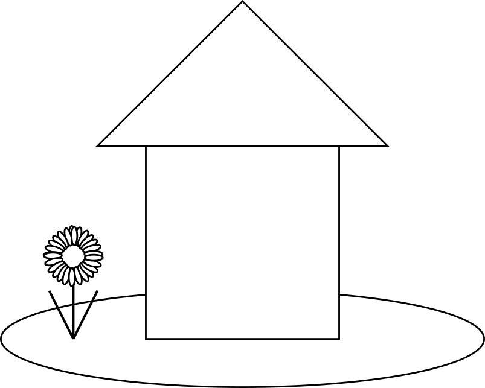

<!-- 
## De 'grote lijnen'
-->

Stel je eens een huis voor en kijk naar dit huis vanuit de verte, of "tussen je wimpers door", zodat je (bijna) alleen de "grote lijnen" van het huis ziet. Zie je ze? //todokai wat zou ik hier moeten zien? wellicht moet je hier een aanwijzing geven.. 



> Zoals een huis bestaat uit de buitenmuren en een dak, bestaat een `p5.js` schets uit:
> 1. een `setup` functie 
> 2. een `draw` functie
>
> Net zoals we ons huis kunnen inrichten zoals we het willen, kunnen we ook het binnenste van de functies, de "body", inrichten zoals we het willen. 
>
> Daarbij, net zoals we de tuin van ons huis kunnen inrichten, kunnen we ook de buitenomgeving (de 'global scope') van deze functies inrichten zoals we het willen. 

```javascript
// global scope

function setup() {
    // function's scope
    createCanvas(400, 400);
}

function draw() {
    // function's scope
    background(220);
}
```
 
Om te zien wat bovenstaande code doet, kopieer en plak de code in je [editor](https://editor.p5js.org) en... draaien maar!
(Schrik niet, er zou nog niet veel moeten gebeuren)


<details>
    <summary>Klik voor meer code!</summary>

Bovenstaande tekening van een huis kan je ook maken in `p5js`, bijvoorbeeld door onderstaande code te kopieren en plakken in de [editor](https://editor.p5js.org)! (Zie je nog meer gebeuren?)
```javascript
WIP enter code from sketches/huis.js
```

</details>
